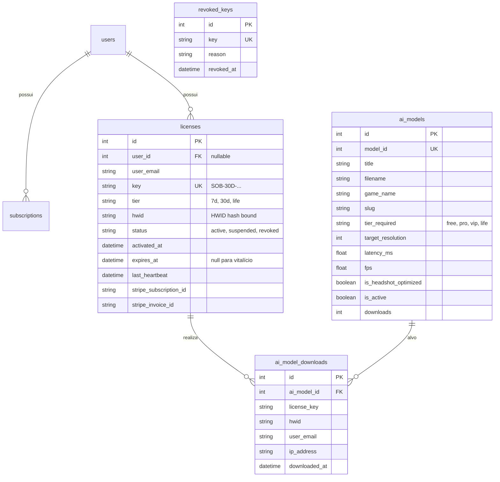

# Documentação Técnica e Operacional — Soberano API & Licensing Core

> **Versão:** 1.0.0-PRO  
> **Classificação:** Confidencial / Arquitetura Soberana  
> **Autoridade:** JESUS  
> **Data:** Setembro / 2026  
> **Branch de Referência:** `feat/api-soberana-v1`  
> **Repositório:** `Luska066/soberano-api`

---

## 1. Visão Geral e Propósito do Sistema

O **Soberano API & Licensing Core** é uma plataforma robusta de backend desenvolvida em **Laravel 11 / PHP 8.4**, projetada para suprir integralmente as necessidades de:

1. **Monetização Automatizada:** Integração com gateway de pagamentos Stripe (via Webhooks atômicos).
2. **Licenciamento Criptográfico & Anti-Pirataria:** Geração de chaves assinadas digitalmente via HMAC/SHA-256 e vinculação física irreversível a hardware específico (**HWID Lock**).
3. **Distribuição Segura de Modelos de IA:** Catálogo auditado de 39 modelos neurais ONNX com benchmark real de hardware, protegidos por controle de acesso por níveis de assinatura (**Tiers**).
4. **Proteção e Comunicação com o Cliente Desktop:** Endpoints de baixa latência para ativação e validação periódica (*Heartbeat*) do software desktop `IA-SOBERANO-GAMES.exe`.

```mermaid
graph TD
    subgraph "Clientes & Usuários"
        UserWeb[Cliente Web / Browser]
        DesktopApp[IA-SOBERANO-GAMES.exe]
    end

    subgraph "Gateway Financeiro"
        StripeCheckout[Stripe Checkout]
        StripeWebhook[Stripe Webhook Handler]
    end

    subgraph "Soberano API Backend (Laravel 11)"
        RouteAPI[API Router / Middleware]
        LicService[LicenseService (HMAC SHA-256)]
        EnsureLicense[Middleware: EnsureActiveLicense]
        ModelCatalog[Catálogo & Benchmark Engine]
    end

    subgraph "Camada de Dados & Armazenamento"
        Database[(SQLite / MySQL Database)]
        ModelVault[(Vault de Modelos ONNX / S3)]
    end

    UserWeb -->|1. Pagamento| StripeCheckout
    StripeCheckout -->|2. Evento invoice.payment_succeeded| StripeWebhook
    StripeWebhook -->|3. Provisiona Chave| LicService
    LicService -->|4. Salva Registro| Database

    DesktopApp -->|5. Ativação HWID / Heartbeat| RouteAPI
    RouteAPI -->|6. Valida Licença| LicService
    
    DesktopApp -->|7. Download de Modelos| EnsureLicense
    EnsureLicense -->|8. Checa Tier & HWID| Database
    EnsureLicense -->|9. Entrega Segura| ModelVault
```

---

## 2. Arquitetura de Segurança & Criptografia

### 2.1 Estrutura da Chave de Licença
As chaves soberanas não são strings aleatórias simples; elas contêm metadados embutidos e uma assinatura criptográfica:

$$\text{Formato:} \quad \mathbf{SOB-\{PLANO\}-\{EXP\_HEX\}-\{SIG\_HEX\}}$$

Exemplo: `SOB-30D-68421880-9A2E`

- **`SOB`**: Prefixo identificador soberano.
- **`{PLANO}`**: Tier do plano (`7D`, `30D`, `LIFE`).
- **`{EXP_HEX}`**: Timestamp Unix em hexadecimal indicando a expiração (`00000000` para Vitalício).
- **`{SIG_HEX}`**: Assinatura criptográfica calculada com base no plano, expiração e um Salt secreto soberano:
  $$\text{Payload} = \text{PLANO} + \text{EXP\_HEX} + \text{SOBERANO\_SALT}$$
  $$\text{SIG\_HEX} = \text{substr}(\text{SHA256}(\text{Payload}), 0, 8)$$

### 2.2 Vinculação de Hardware (HWID Lock)
Para anular pirataria, vazamentos de chaves e revenda clandestina de acessos:

1. **Geração do HWID:** O executável em Rust gera um hash unidirecional SHA-256 combinando CPU ID, UUID da placa-mãe e volume serial (ex: `SOB-7E4A-91C2-88E1`). Nenhum dado pessoal do usuário é transmitido.
2. **First-Use Binding:** Na primeira ativação (`POST /api/v1/auth/activate`), se o campo `hwid` estiver vazio no banco, o sistema registra permanentemente o HWID daquela máquina.
3. **Bloqueio de Compartilhamento:** Se uma segunda máquina tentar ativar a mesma licença, o backend detecta o conflito (`hwid !== saved_hwid`) e responde imediatamente com `403 Forbidden: Licença já vinculada a outro computador`.
4. **Heartbeat Periódico:** A cada $N$ minutos de execução do jogo, o app dispara `POST /api/v1/auth/verify`. Caso a licença tenha sido cancelada, contestada na Stripe ou revogada manualmente pelo Administrador, o app recebe a ordem imediata de encerramento (*Kill Switch*).

---

## 3. Modelo de Dados & Esquema Relacional

O banco de dados foi desenhado com foco em performance e integridade:



---

## 4. Integração Stripe & Automação Financeira

O fluxo de processamento de pagamentos opera sem intervenção manual:

1. O cliente assina ou compra na página web via Stripe Checkout.
2. A Stripe dispara o webhook `invoice.payment_succeeded` para o endpoint da API (`/stripe/webhook`).
3. O serviço `InvoiceWebhookChannels.php` intercepta o evento:
   - Extrai o e-mail do cliente, o valor pago e o ID da assinatura.
   - Determina o tipo de plano baseado no valor ou metadata:
     - $\le R\$ 50,00 \rightarrow$ Plano `7D` (7 dias).
     - $\le R\$ 120,00 \rightarrow$ Plano `30D` (30 dias).
     - $> R\$ 120,00 \rightarrow$ Plano `LIFE` (Vitalício).
   - Se o cliente já tiver uma licença daquela assinatura, o prazo é somado (renovação).
   - Se for um novo cliente, uma chave inédita é gerada pelo `LicenseService` e gravada com status `active`.

---

## 5. Catálogo de Inteligência Artificial & Tiers de Acesso

O catálogo armazena 39 modelos neurais ONNX sincronizados do manifesto de alta performance (`VAULT_INDEX.json`). Cada modelo possui medições científicas reais obtidas em hardware dedicado (NVIDIA GeForce RTX 3060 Ti via CUDA):

### Níveis de Permissão (Tiers Matrix)

| Tier do Modelo | Planos Autorizados | Exemplos de Modelos |
| :--- | :--- | :--- |
| **`free`** | `7D`, `30D`, `LIFE` | Modelos padrão comunitários de menor resolução (256p). |
| **`pro`** | `7D`, `30D`, `LIFE` | Modelos balanceados otimizados para alto FPS (320p/416p). |
| **`vip`** | `30D`, `LIFE` | Modelos de alta precisão calibrados para Headshot nativo (480p/512p). |
| **`life`** | Apenas `LIFE` | Redes neurais de ponta exclusivas para assinantes vitalícios (640p). |

### Middleware de Proteção (`EnsureActiveLicense`)
Toda requisição ao endpoint de download `/api/v1/models/{id}/download` é submetida ao crivo:
- **Ausência de Header:** Retorna `401 Unauthorized`.
- **HWID Incompatível:** Retorna `403 Forbidden (HWID Mismatch)`.
- **Licença Expirada / Revogada:** Retorna `403 Forbidden (Expired/Revoked)`.
- **Tentativa de Acesso a Modelo Superior:** Retorna `403 Forbidden (Tier Insufficient)`.

---

## 6. Especificação da API RESTful (Endpoints)

### 6.1 Autenticação & Licenciamento

#### `POST /api/v1/auth/activate`
Vincula e ativa a licença na máquina do usuário.

- **Headers:** `Content-Type: application/json`
- **Body:**
  ```json
  {
    "key": "SOB-30D-68421880-9A2E",
    "hwid": "SOB-7E4A-91C2-88E1"
  }
  ```
- **Respostas:**
  - `200 OK`: Ativação bem-sucedida, retorna token e tempo restante.
  - `403 Forbidden`: Chave inválida, expirada, revogada ou HWID conflitante.

#### `POST /api/v1/auth/verify`
Heartbeat enviado periodicamente pelo jogo para confirmar autorização contínua.

- **Body:**
  ```json
  {
    "key": "SOB-30D-68421880-9A2E",
    "hwid": "SOB-7E4A-91C2-88E1"
  }
  ```

### 6.2 Catálogo & Downloads

#### `GET /api/v1/models`
Listagem pública paginada dos modelos disponíveis.

- **Parâmetros Opcionais:** `game=Fortnite`, `headshot_only=1`, `sort=fastest`, `page=1`.
- **Retorno:**
  ```json
  {
    "success": true,
    "total": 36,
    "data": [
      {
        "id": 1,
        "title": "Project World's Best Fn Model",
        "game_name": "Fortnite",
        "fps": 182.4,
        "latency_ms": 5.48,
        "is_headshot_optimized": true,
        "tier_required": "pro"
      }
    ]
  }
  ```

#### `GET /api/v1/models/{id}/download`
Download binário direto do arquivo `.onnx`.

- **Headers Obrigatórios:**
  - `X-License-Key`: `SOB-30D-68421880-9A2E`
  - `X-HWID`: `SOB-7E4A-91C2-88E1`
- **Retorno:** Stream binário do arquivo (`application/octet-stream`) ou erro estruturado `401` / `403`.

---

## 7. Validação por Bateria de Testes Sintéticos

Para certificar a resiliência do sistema, foi desenvolvido o script executável `TESTE_SINTETICO_COMPLETO.sh`. O script executa 10 cenários sequenciais em ambiente real:

```text
[1/10] Webhook Stripe: Simulação de pagamento e emissão atômica de licença...... [APROVADO]
[2/10] Ativação HWID: Vinculação bem-sucedida da licença à máquina 1............ [APROVADO]
[3/10] Heartbeat: Validação de sessão ativa e atualização de timestamp.......... [APROVADO]
[4/10] Anti-Pirataria: Rejeição de tentativa de uso do HWID da máquina 2........ [APROVADO]
[5/10] Catálogo Público: Consulta e paginação dos modelos disponíveis.......... [APROVADO]
[6/10] Bloqueio Não-Autenticado: Tentativa de download sem licença (HTTP 401)... [APROVADO]
[7/10] Bloqueio por Tier: Tentativa de download de modelo VIP com plano 7D...... [APROVADO]
[8/10] Download Autorizado: Download com licença válida e registro em log........ [APROVADO]
[9/10] Revogação Remota: Invalidação de chave via API Administrativa........... [APROVADO]
[10/10] Kill-Switch: Bloqueio imediato da chave revogada no Heartbeat (HTTP 403) [APROVADO]
```

---

## 8. Guia Operacional & Procedimentos de Deploy

### 8.1 Execução Local em Desenvolvimento

Para inicializar a API com todos os serviços:
```bash
cd ~/WORKSPACE_CORE/2_Projetos_e_Bots/soberano-api
./INICIAR_API.sh
```

Para re-sincronizar os modelos do catálogo:
```bash
php artisan soberano:sync-models
```

Para rodar os testes:
```bash
./TESTE_SINTETICO_COMPLETO.sh
```

### 8.2 Procedimento de Deploy em Produção (VPS)

1. **Requisitos de Servidor Recomendados:**
   - SO: Ubuntu 24.04 LTS ou Debian 12
   - CPU: 2 vCPUs | RAM: 2GB a 4GB | Disco: 40GB SSD
   - Softwares: Nginx, PHP 8.4-FPM (`php8.4-bcmath`, `php8.4-sqlite3`, `php8.4-curl`, `php8.4-mbstring`), Composer 2, Git, Certbot (SSL).

2. **Passo a Passo de Instalação na VPS:**
   ```bash
   # Clonar o repositório oficial na branch soberana
   git clone -b feat/api-soberana-v1 https://github.com/Luska066/soberano-api.git /var/www/soberano-api
   cd /var/www/soberano-api

   # Instalar dependências PHP e compilar assets
   composer install --no-dev --optimize-autoloader
   npm install && npm run build

   # Configurar ambiente de produção
   cp .env.example .env
   php artisan key:generate

   # Inserir as chaves da Stripe de Produção no .env (STRIPE_KEY, STRIPE_SECRET)
   # Executar as migrations do banco
   php artisan migrate --force
   php artisan soberano:sync-models

   # Permissões de escrita
   chown -R www-data:www-data storage bootstrap/cache
   chmod -R 775 storage bootstrap/cache
   ```

3. **Configuração do Nginx (Virtualhost com SSL):**
   ```nginx
   server {
       listen 80;
       server_name api.seusite.com;
       return 301 https://$host$request_uri;
   }

   server {
       listen 443 ssl http2;
       server_name api.seusite.com;
       root /var/www/soberano-api/public;

       ssl_certificate /etc/letsencrypt/live/api.seusite.com/fullchain.pem;
       ssl_certificate_key /etc/letsencrypt/live/api.seusite.com/privkey.pem;

       index index.php;
       charset utf-8;

       location / {
           try_files $uri $uri/ /index.php?$query_string;
       }

       location ~ \.php$ {
           fastcgi_pass unix:/run/php/php8.4-fpm.sock;
           fastcgi_param SCRIPT_FILENAME $realpath_root$fastcgi_script_name;
           include fastcgi_params;
       }

       location ~ /\.(?!well-known).* {
           deny all;
       }
   }
   ```

4. **Configuração de Armazenamento de Arquivos Pesados:**
   - **Modo Servidor Local:** Carregar a pasta com os `.onnx` para `/var/www/soberano-api/storage/app/models/`.
   - **Modo Cloudflare R2:** Criar um bucket privado no R2 e apontar as credenciais S3 (`AWS_ACCESS_KEY_ID`, `AWS_SECRET_ACCESS_KEY`, `AWS_BUCKET`, `AWS_ENDPOINT`) no `.env`.

---

## 9. Manutenção & Suporte

- **Logs do Sistema:** Acompanhar eventos em tempo real com `tail -f storage/logs/laravel.log`.
- **Reset de HWID:** Em caso de cliente que formatou o PC ou trocou de peça de hardware, o suporte executa:
  ```bash
  curl -X POST http://api.seusite.com/api/v1/licenses/reset-hwid \
       -H "Authorization: Bearer <SOBERANO_ADMIN_SECRET>" \
       -H "Content-Type: application/json" \
       -d '{"key": "SOB-30D-68421880-9A2E"}'
  ```
- **Revogação Instantânea (Chargeback / Fraude):**
  ```bash
  curl -X POST http://api.seusite.com/api/v1/licenses/revoke \
       -H "Authorization: Bearer <SOBERANO_ADMIN_SECRET>" \
       -H "Content-Type: application/json" \
       -d '{"key": "SOB-30D-68421880-9A2E", "reason": "Chargeback no cartão"}'
  ```

---
*Documento homologado sob diretrizes do Protocolo Soberano.*
